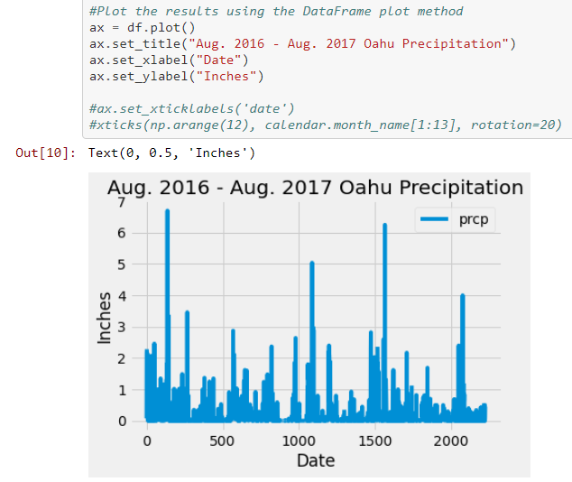

# Surfs Up! - An SQLAlchemy Project

## Background
In this project, I tasked myself with climate analysis of Hawaii by using advanced data storage and retrieval using SQLAlchemy ORM queries, Pandas, and Matplotlib

**NOTE**: The [sqlite database](https://github.com/jaryan77/sqlalchemy-challenge/blob/main/Resources/hawaii.sqlite) for this project was already provided.

## Climate Analysis and Exploration

* Using SQLAlchemy `create_engine`, I connected to my sqlite database
* Next, I used `automap_base()` to reflect my tables into classes and saved a reference to those classes called `Station` and `Measurement`.
* Finally, link Python to the database by creating an SQLAlchemy session.

### Precipitation Analysis
* By finding the most recent date in the data set, I retrieved the last 12 months of precipitation data by querying the 12 preceding motnhs of data. 
    * I was careful not to pass in the date as a variable to my query.

* Next, I selected `date` and `prcp` values, loaded the query results into Pandas DataFrame and set the index to the date column, and sort the DataFrame values by `date`.
* Next, I plotted the results using the DataFrame `plot` method.

